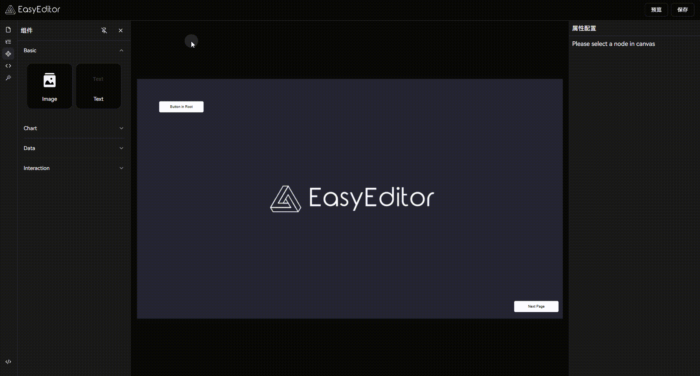
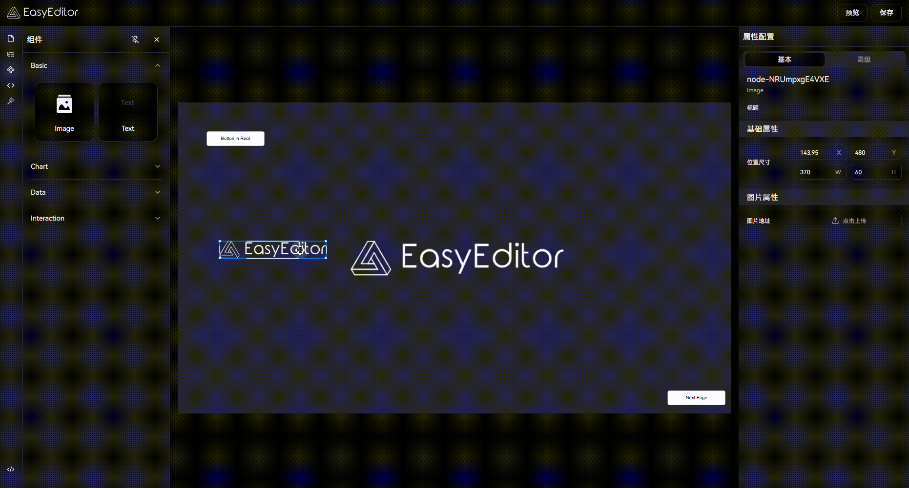
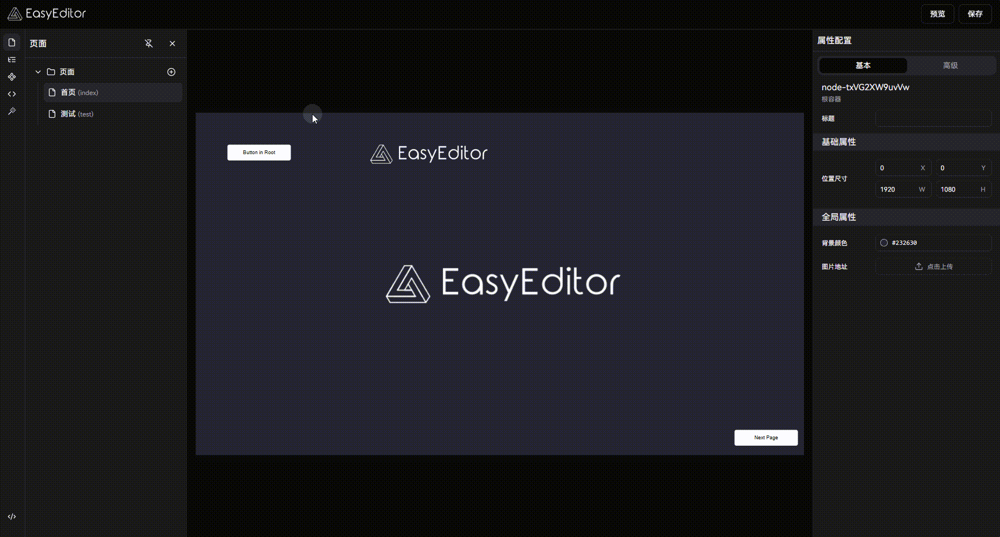
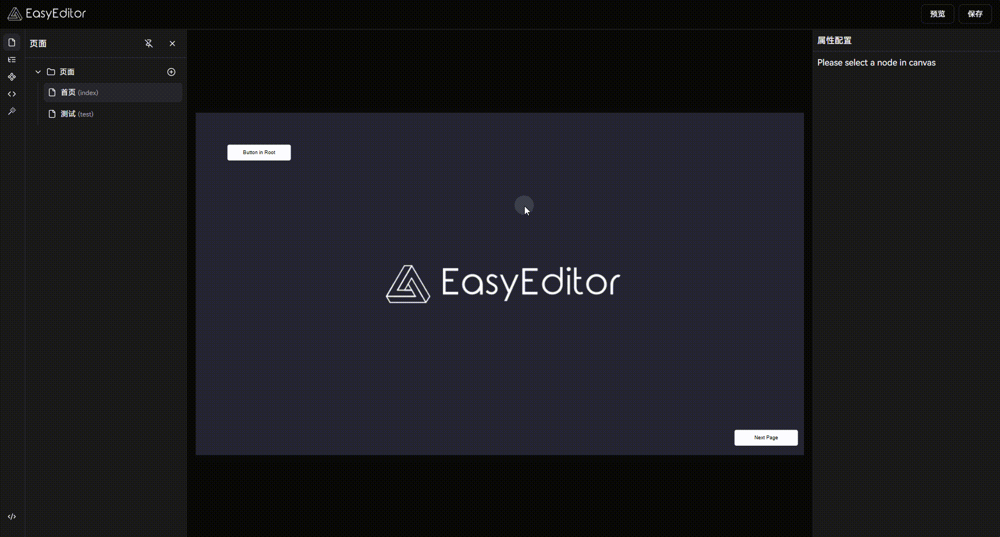

# EasyDashboard

<div align="center">

[English](./README.md) | 简体中文

</div>

EasyDashboard 是基于 [EasyEditor](https://github.com/Easy-Editor/EasyEditor) 低代码引擎开发的数据可视化大屏解决方案。本项目展示了如何使用 EasyEditor 的 Dashboard 插件和 React 渲染器快速构建专业的数据可视化应用。

内置 20+ 预置组件、AI 辅助设计、多页面支持和实时预览 — 基于 React 19、Tailwind CSS v4 和 shadcn/ui 构建。

<div align="center">
  
</div>

## 功能特性

### 设计与编辑

- **拖拽式画布**，支持多页面和可配置分辨率（默认 1920x1080）
- **实时属性检查器**，提供 20+ 种设置器类型，精细化组件配置
- **快捷键系统**，支持复制、粘贴、撤销/重做、对齐、分组、图层排序等操作
- **智能辅助线**，自动对齐与精确定位
- **三种编辑模式**：设计画布、代码（JSON Schema 编辑器）和预览

### 组件与物料

- **20 个预置组件**，涵盖 7 大类别：
  - **基础**：文本
  - **图表**：柱状图、折线图、饼图、仪表盘、雷达图、散点图
  - **展示**：轮播、数字翻牌、进度条、滚动列表
  - **媒体**：音频、视频、图片、滤镜
  - **交互**：按钮
  - **地图**：飞线、地理地图
- **按需远程加载** — 物料从 npm CDN 按需获取
- **可扩展物料系统** — 构建并注册自定义组件

### 数据与交互

- **多数据源支持**：静态数据、REST API 和全局共享数据
- **动态可见性控制**，支持 JavaScript 表达式
- **事件绑定**，触发动作和组件方法

### 开发体验

- **AI 助手** — 用自然语言描述需求，AI 直接在画布上生成组件
- **自动保存** — 项目 Schema 自动持久化到 LocalStorage
- **暗色模式**，支持系统偏好检测
- **导入/导出** JSON 格式的项目 Schema

## 功能展示

- **组件拖拽：** 快速将组件和数据元素拖放到设计面板上，轻松完成布局。



- **辅助线：** 自动显示的辅助线确保组件精确对齐，提升设计效率。



- **多页面：** 支持多页面设计，创建完整的交互式数据大屏。



- **可见性控制：** 实现组件的动态可见性控制，让数据展示更加灵活。



还有更多功能等待你去发现和探索。

## 快速开始

### 环境要求

- Node.js >= 18.0.0
- pnpm >= 9.12.2

### 本地开发

```bash
# 克隆项目
git clone https://github.com/Easy-Editor/EasyDashboard

# 进入项目目录
cd EasyDashboard

# 安装依赖
pnpm install

# 启动开发服务器
pnpm dev
```

### 可用脚本

```bash
pnpm dev          # 启动开发服务器
pnpm build        # 构建生产版本（含类型检查）
pnpm build:prod   # 构建生产版本（跳过类型检查）
pnpm preview      # 预览生产构建
pnpm lint         # 运行代码质量检查
pnpm format       # 使用 Biome 格式化代码
pnpm add:ui       # 添加 shadcn/ui 组件
```

## 贡献

欢迎贡献！请随时提交 Issue 和 Pull Request 来帮助改进本项目。

## 许可证

[MIT](./LICENSE) License &copy; 2024-PRESENT [JinSo](https://github.com/JinSooo)

## 相关链接

本项目基于 [EasyEditor](https://github.com/Easy-Editor/EasyEditor) 低代码引擎开发，展示了如何使用 EasyEditor 构建专业的数据可视化应用。
