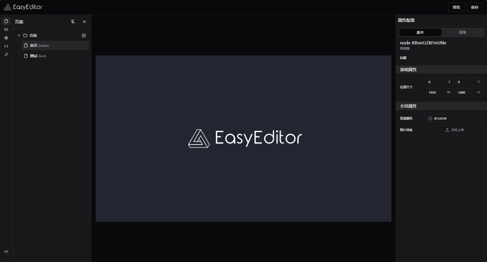

# EasyDashboard

EasyDashboard 是基于 [EasyEditor](https://github.com/Easy-Editor/EasyEditor) 低代码引擎开发的数据可视化大屏解决方案。本项目展示了如何使用 EasyEditor 的 Dashboard 插件和 React 渲染器来快速构建专业的数据可视化应用。

<div align="center">
  
</div>


## ✨ 特性

- 🎨 **丰富的可视化组件**：内置多种图表组件和数据展示组件，支持自定义扩展
- 🔌 **即插即用**：基于 EasyEditor 插件体系，支持组件的拖拽式开发
- 💅 **现代化设计**：采用磨砂玻璃态设计，支持炫酷背景和渐变效果
- 📱 **响应式布局**：支持多种屏幕尺寸，默认适配 1920x1080 分辨率
- 🔄 **实时数据**：支持数据实时刷新和自动更新机制
- 🎮 **交互增强**：支持全屏展示、数据筛选等高级交互功能
- 🎯 **开箱即用**：提供完整的示例模板和组件配置

## 📦 组件库

### 图表组件
- **基础图表**
  - AreaChart - 面积图
  - LineChart - 折线图
  - BarChart - 柱状图
  - PieChart - 饼图
  - RadarChart - 雷达图
  - RadialChart - 环形图
- **高级图表**
  - BarChartHorizontal - 横向柱状图
  - BarChartStacked - 堆叠柱状图
  - PieChartStacked - 堆叠饼图
  - PieChartDonut - 环形饼图
  - RadarChartLines - 多线雷达图
  - RadialChartText - 带文本环形图
  - RadialChartStacked - 堆叠环形图

### 数据展示
- Table - 表格
- Progress - 进度条
- Carousel - 轮播图

### 交互组件
- Button - 按钮
- Input - 输入框
- Select - 选择器
- Combobox - 组合框
- Calendar - 日历
- CalendarButton - 日历按钮
- Toggle - 开关
- ToggleGroup - 开关组
- Sonner - 消息提示

### 基础组件
- Text - 文本
- Image - 图片

## 🛠️ 调试

### 环境要求

- Node.js >= 18.0.0
- pnpm >= 9.12.2
- React >= 18.0.0

### 本地开发

```bash
# 克隆项目
git clone <your-repository-url>

# 进入项目目录
cd EasyDashboard

# 安装依赖
pnpm install

# 启动开发服务器
pnpm dev
```

### 构建部署

```bash
# 构建生产版本
pnpm build

# 预览生产构建
pnpm preview
```

### 开发提示

- 使用 React DevTools 调试组件状态
- 查看控制台输出的生命周期和事件日志
- 通过 Schema 面板实时查看和修改组件配置
- 使用内置的调试工具栏进行布局调整

## 📝 协议

MIT License © 2024

## 🔗 相关链接

本项目基于 [EasyEditor](https://github.com/Easy-Editor/EasyEditor) 低代码引擎开发，展示了如何使用 EasyEditor 构建专业的数据可视化应用。
