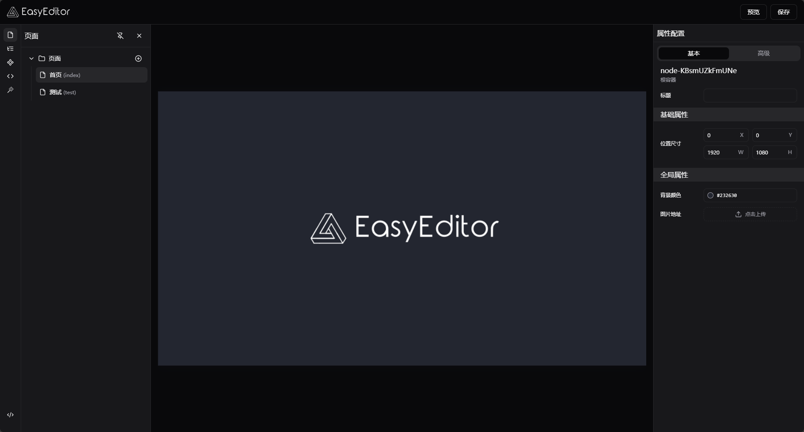

# EasyDashboard

<div align="center">

English | [简体中文](./README-zh_CN.md)

</div>

EasyDashboard is a personal workspace for building and publishing data
visualization dashboards with the
[EasyEditor](https://github.com/Easy-Editor/EasyEditor) low-code engine. The
repository contains a React editor, a Hono API, and a separate cookie-less
public viewer.

<div align="center">
  
</div>

## Current capabilities

- Create, search, favorite, duplicate, trash, and restore projects in a
  server-provisioned personal space.
- Build multi-page dashboards with drag-and-drop editing, property
  configuration, JSON schema editing, page ordering, and a configurable start
  page.
- Save drafts to PostgreSQL with optimistic concurrency. Project documents are
  not persisted to LocalStorage.
- Create manual restore points, retain periodic automatic restore points, and
  restore a previous snapshot without deleting the existing history.
- Generate automatic project thumbnails or upload a custom thumbnail through a
  private Supabase Storage bucket and signed URLs.
- Publish the saved draft to both a stable viewer URL and a versioned URL backed
  by an immutable release snapshot.
- Sign in with email and password, GitHub, or Google. The Hono API keeps
  Supabase sessions in secure host-only cookies.

Agent execution, templates as a product workflow, team collaboration, and 3D
editing are not part of the current application.

## Workspace

This repository is a pnpm workspace:

```text
EasyDashboard/
├── api/                     # thin Vercel Function adapter
├── server/                  # portable Hono API and Node development adapter
├── src/                     # authenticated React application and editor
├── supabase/migrations/     # ordered database and storage migrations
├── viewer/                  # separate cookie-less public viewer
└── pnpm-workspace.yaml
```

## Requirements

- Node.js 22 or later
- pnpm 10.28.2
- A Supabase project with PostgreSQL, Auth, and Storage

## Local development

1. Install the workspace dependencies:

   ```bash
   pnpm install --frozen-lockfile
   ```

2. Create `.env` from [`.env.example`](./.env.example) and replace every
   placeholder. Apply every SQL file in `supabase/migrations/` in filename
   order, then set a password for the `easy_dashboard_runtime` role as described
   in [the deployment guide](./docs/DEPLOYMENT.md).

3. Configure Supabase Auth redirect URLs and the GitHub/Google providers. The
   exact callback values are listed in
   [the deployment guide](./docs/DEPLOYMENT.md#3-authentication).

4. Start all three development processes:

   ```bash
   pnpm dev
   ```

The authenticated app runs on `http://localhost:5173`, the viewer on
`http://localhost:5174`, and the API on `http://localhost:8787`.

## Scripts

| Command | Purpose |
| --- | --- |
| `pnpm dev` | Start the app, viewer, and API |
| `pnpm dev:web` | Start only the authenticated app |
| `pnpm dev:viewer` | Start only the public viewer |
| `pnpm dev:server` | Start only the Hono API |
| `pnpm build` | Build the app, viewer, and server |
| `pnpm typecheck` | Type-check all three workspace applications |
| `pnpm test` | Run the web, public Viewer, and server test suites |
| `pnpm lint` | Run Biome checks |
| `pnpm format` | Format the workspace with Biome |

## Architecture and deployment

- [Architecture](./docs/ARCHITECTURE.md)
- [Product design](./docs/PRODUCT-DESIGN.md)
- [Supabase and Vercel deployment](./docs/DEPLOYMENT.md)
- [Remote materials](./docs/remote-materials.md)

## Contributing

Contributions are welcome. Open an issue or pull request with a focused change
and its verification evidence.

## License

[MIT](./LICENSE) License &copy; 2024-PRESENT
[JinSo](https://github.com/JinSooo)
