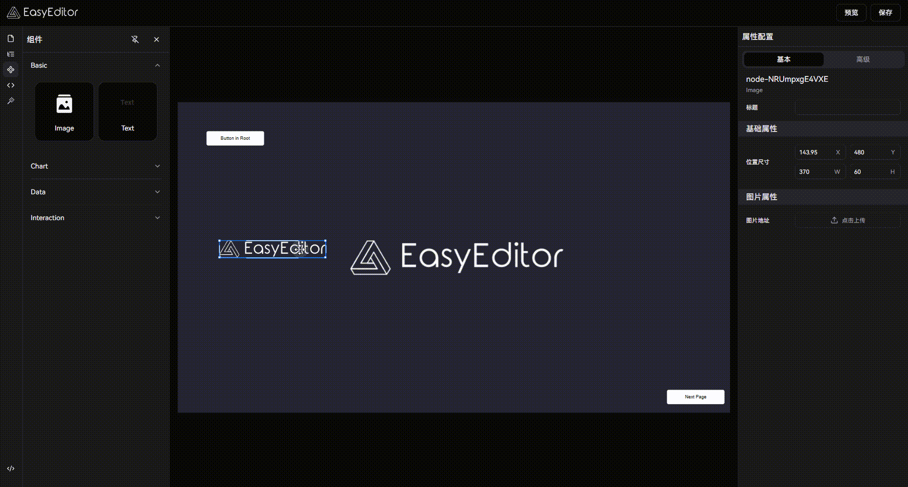

# EasyDashboard

EasyDashboard is a data visualization dashboard solution developed based on the [EasyEditor](https://github.com/Easy-Editor/EasyEditor) low-code engine. This project demonstrates how to quickly build professional data visualization applications using EasyEditor's Dashboard plugin and React renderer.

<div align="center">
  
</div>

## Features

- **Rich Visualization Components**: Built-in various chart components and data display components, supporting custom extensions.
- **Plug-and-Play**: Based on the EasyEditor plugin system, supporting drag-and-drop development of components.
- **Modern Design**: Adopts a frosted glass design, supporting cool backgrounds and gradient effects.
- **Responsive Layout**: Supports multiple screen sizes, defaulting to a resolution of 1920x1080.
- **Real-Time Data**: Supports real-time data refresh and automatic update mechanisms.
- **Enhanced Interactivity**: Supports full-screen display, data filtering, and other advanced interactive features.
- **Out-of-the-Box**: Provides complete example templates and component configurations.

## Showcase

- **Component Drag and Drop:** Quickly drag and drop components and data elements onto the design panel for easy layout.


- **Guidelines:** Automatically displayed guidelines ensure precise component alignment, enhancing design efficiency.



- **Multiple Pages:** Support for multiple page designs to create complete interactive data dashboards.


- **Visibility Control:** Implement dynamic visibility control of components for more flexible data presentation.


There are many more features waiting for you to discover and explore.

## Debug

### Environment Requirements

- Node.js >= 18.0.0
- pnpm >= 9.12.2

### Local Development

```bash
# Clone the project
git clone https://github.com/Easy-Editor/EasyDashboard

# Navigate to the project directory
cd EasyDashboard

# Install dependencies
pnpm install

# Start the development server
pnpm dev
```

### Build and Deployment

```bash
# Build the production version
pnpm build

# Preview the production build
pnpm preview
```

## Contributing

Contributions are welcome! Please feel free to submit issues and pull requests to help improve this project.

## License

[MIT](./LICENSE) License &copy; 2024-PRESENT [JinSo](https://github.com/JinSooo)

## Related Links

This project is developed based on the [EasyEditor](https://github.com/Easy-Editor/EasyEditor) low-code engine, demonstrating how to use EasyEditor to build professional data visualization applications.
