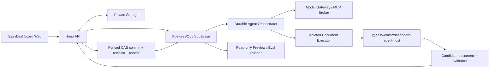

# EasyDashboard Agent V1 产品与系统方案

> 状态：V1 核心创作闭环已实现；本文同时保留后续强化合同
>
> 当前运行时真相：以 [`ARCHITECTURE.md`](./ARCHITECTURE.md)、代码与测试为准
>
> 实施计划：[`../.omx/plans/easy-dashboard-agent-v1.md`](../.omx/plans/easy-dashboard-agent-v1.md)
>
> 更新时间：2026-08-01

## 1. 结论

EasyDashboard Agent V1 不是一个附着在编辑器旁边的通用聊天框，也不是让
模型直接生成一张不可编辑的图片。它是一条面向真实大屏交付的默认创作路径：

```text
描述目标 / 上传参考资料
  -> 原子创建项目、私有对话和首个任务
  -> Agent 理解、必要时提问、规划
  -> 分阶段修改同一份可编辑项目草稿
  -> 用户随时进入手动编辑器共同调整
  -> Agent 使用真实预览验证
  -> Owner 对固定快照授权发布
  -> 后续通过多个私有对话持续迭代
```

大屏项目仍然是产品核心，Agent 是默认的创作方式，手动编辑器是同等重要的
精确控制方式。两者操作同一份项目文档、同一套版本、同一套数据源和同一套
发布链路。

### 北极星结果

用户可以从一句模糊需求和可选的图片、文件、数据样例开始，得到一个：

- 可编辑；
- 可预览；
- 可恢复；
- 可验证；
- 可发布；
- 可以继续对话修改；

的真实大屏项目。

### 北极星指标

主指标是“真实任务被用户接受为可交付大屏的比例”，不是对话数、Token 数或
生成组件数。

辅助指标包括：

- 首次得到可用大屏的时间；
- 达到验收所需的对话轮数；
- 任务失败率和恢复成功率；
- 用户撤销 Agent 修改的比例；
- 单个被接受任务的实际或估算成本；
- 真实预览和发布门禁通过率。

## 2. 当前态与目标态

当前实现已覆盖从首条需求到可撤销草稿变更的 Agent 创作主链。本文后续章节仍包含
比当前交付更完整的产品合同；未出现在下表“当前实现”中的能力不得视为已经上线。

| 能力 | 当前实现 | Agent V1 目标 |
| --- | --- | --- |
| 项目与多页面编辑 | 已实现 | 继续作为唯一内容模型 |
| 草稿版本与恢复点 | 已实现 | 作为 Agent 原子阶段和撤销基础 |
| 预览、发布、公开 Viewer | 已实现固定快照、可信隔离执行器渲染证据、一次性审批和真实发布状态；普通客户端缩略图不能充当发布证明 | 继续补充产品级异常说明和运维观测 |
| Owner / Editor / Viewer 数据基础 | 已实现项目成员关系、最终 Owner 保护、路由授权和 RLS | 继续补充成员管理产品体验 |
| Agent Runtime | 已实现持久 Turn、冻结模型输入、Worker/代际栅栏、严格 ChangeSet、受权执行器、阶段提交、安全撤销和崩溃恢复 | 继续强化生产 Worker 运维和事件流观测 |
| Agent 首页与项目对话 | 已实现 Agent-first 首页、原子首条消息启动和项目 Agent 工作台 | 持续完善真实浏览器验收和异常恢复文案 |
| 私有多对话与后台任务 | 已实现用户/项目隔离的多对话 CAS 同步、持久 Turn/operation/dispatch、轮询恢复、澄清续答和可见阶段 | 继续强化长任务事件流和跨实例恢复演练 |
| 项目上下文与用户偏好 | 已实现透明可编辑的共享项目记忆、来源/事实推断标记、历史回滚，以及服务端用户偏好 | 继续补充冲突可视化 |
| 文件与素材输入 | 已实现项目/对话范围的签名上传、文本提取、受控图片字节输入和两阶段安全删除 | 扩展更多文件类型和按需检索策略 |
| 服务端模型网关与费用账本 | 已实现平台/自定义模型配置、加密密钥、能力探测、完整输入预算预留、逐 Turn 结算、缓存 Token 和调用耗时证据 | 供应商未返回实际金额时仍为 Token 估算；后续可对接账单核验 |
| Skill / MCP | 已实现内置 Skill 选择、版本化 trace 和 MCP 授权策略合同；没有开放配置或任意调用入口 | 仅按明确产品需求接入受控 MCP |
| 自定义组件沙箱 | EasyEditor 示例已有合同基础 | 产品化并强化隔离 |
| 固定评测集 | 已有离线固定用例、评分器和候选/基线比较脚本；当前按产品决策暂缓视觉质量调优 | 后续与视觉方案一起接入录制结果和发布阈值 |

现有 `src/components/ai-chat/AiChatDialog.tsx` 仍是隔离的历史编辑器实验，会直接从浏览器
调用第三方模型并读取 `VITE_DEER_API_KEY`。它不属于 V1 Agent 主链，也不能承载任何
生产模型能力；生产 Agent 调用只通过受认证的服务端模型网关。

## 3. 产品边界

### 3.1 核心用户

V1 优先服务：

- 需要实际交付大屏的个人开发者；
- 懂一些前端、设计或数据配置，但不想从空画布开始的人；
- 需要根据需求文档、参考图和已有数据快速完成项目的人；
- 会在 Agent 生成后继续手动精调的人。

它不是面向所有知识工作的通用 Agent，也不是无代码网站生成器。

### 3.2 核心工作

V1 必须完成以下闭环：

1. 新建大屏；
2. 理解并组织需求；
3. 生成或修改页面、组件、布局、样式和数据绑定；
4. 使用素材和参考图片；
5. 进入手动编辑器精调；
6. 检查实际渲染、数据和运行错误；
7. 撤销本次修改或恢复历史；
8. 经授权发布；
9. 在同一项目内创建更多私有对话继续工作。

### 3.3 V1 非目标

- 默认多 Agent、Agent 群或并行模型协作；
- 一个任务中隐式切换多个模型；
- AI 图片生成为核心能力；
- 开放 Skill 市场或任意第三方 MCP；
- 实时多人协作、在线光标、CRDT 和自动分支合并；
- 平台充值、代扣或完整计费系统；
- 所有分辨率的响应式交付保证；
- 管理员查看成员的私有对话内容；
- Agent 自动修改核心提示词；
- 任意网络、任意依赖、任意脚本在主页面上下文执行；
- 未经授权创建外部连接、写外部系统或发布；
- 用一张截图或不可编辑 HTML 冒充大屏项目。

## 4. 信息架构与入口

### 4.1 目标路由

| 页面 | 目标路由 | 说明 |
| --- | --- | --- |
| Agent 首页 | `/` | 登录后的默认入口和首条消息创建器 |
| 项目管理 | `/projects` | 搜索、整理、成员和生命周期管理 |
| 项目 Agent 工作台 | `/projects/:projectId/agent/:conversationId?` | 完整对话、任务和预览工作区 |
| 手动编辑器 | `/projects/:projectId/editor` | 继续使用现有全屏编辑路由 |
| 草稿预览 | `/projects/:projectId/preview` | 现有预览，加 Agent 验证入口 |
| 项目设置 | `/projects/:projectId/settings` | 成员、预算、模型、连接和 MCP |
| 个人设置 | `/settings` | 用户偏好、个人模型配置和隐私 |

完整 Agent 工作台与手动编辑器是同一项目中的两种一级模式：

```text
Project
├── Agent 模式（默认）
│   ├── 私有对话列表
│   ├── 当前对话
│   ├── 任务线程与阶段
│   ├── 项目预览
│   └── 项目上下文
└── 手动模式
    ├── 现有 Canvas / Code 编辑
    └── 轻量 Agent 入口
```

手动编辑器中的轻量入口必须连接到用户选择的同一
`projectId + conversationId + taskId`，不能偷偷创建另一套影子会话。

如果当前任务正在写项目，进入手动编辑器会先请求任务在下一个安全阶段边界暂停
并释放项目写租约；只读分析不会阻塞手动编辑。人工保存后，恢复的 Agent 必须
重新观察新版本。

### 4.2 登录后的首次使用

首页默认显示大输入区，而不是先要求用户填写项目表单。

用户可以：

- 输入目标；
- 上传参考图、需求文件或数据样例；
- 选择已有资料；
- 展开高级选项设置项目名和主分辨率；
- 进入次要入口“创建空白项目”。

点击发送后，服务端使用客户端幂等键，在一次数据库事务中创建：

```text
Project + private Conversation + Task + Workspace
```

事务成功后，首页附件使用该项目和私有对话签发的短期上传凭据写入资料区；每个
文件携带稳定幂等键，响应丢失后的重试会复用同一份资产。附件上传或解析尚未完成
时，任务停留在“等待附件”阶段，不会提前调用模型；全部就绪后再以 CAS 推进
Workspace 并开始执行。创建或上传失败时保留原输入和客户端幂等键，重试不得产生
重复项目、任务或附件。

模型调用不在创建事务中执行。事务成功后页面进入刚创建的项目 Agent 工作台，
附件就绪后由执行服务处理任务。首条消息幂等键按当前项目生命周期保留。

### 4.3 已有项目

进入已有项目时：

- 默认打开 Agent 模式；
- 恢复该用户最近使用的私有对话；
- 用户可以创建多个私有对话；
- 用户可以切换到手动编辑器；
- 从手动编辑器返回时保持原对话、任务、阶段和费用状态。

## 5. 对话、任务与可见进度

### 5.1 对话归属

每个 Conversation 归属：

```text
projectId + ownerUserId
```

默认 `visibility = private`。同一项目中的其他成员，包括 Owner，都不能查看原始
消息、附件正文或对话标题。Owner 只能查看审计元数据，例如谁在什么时间发起了
任务、任务状态、费用和影响的项目版本。

用户可以在同一项目内创建多个对话，例如：

- 首次生成；
- 数据接入；
- 视觉精调；
- 修复某个页面；
- 发布前检查。

### 5.2 一条对话包含什么

对话不是只有消息流，还包含内联任务线程：

```text
Conversation
├── Messages
├── Attachments / Project asset references
└── Tasks
    ├── Goal
    ├── Visible plan
    ├── Milestones
    ├── Authorization requests
    ├── Cost summary
    ├── Verification result
    └── Recovery action
```

默认展示业务粒度的进度：

- 正在理解需求；
- 已完成布局；
- 正在绑定数据；
- 正在检查预览；
- 等待你的回答；
- 等待 Owner 授权；
- 已完成；
- 已失败并回退。

模型请求、Tool Call、Token、错误栈和 receipt 等技术信息放在可展开详情中。
产品不得展示模型的隐藏思维链。

### 5.3 任务状态

```text
QUEUED
  -> ANALYZING
  -> PLANNING
  -> EXECUTING_STAGE
  -> VERIFYING_STAGE
  -> SUCCEEDED

运行中
  -> WAITING_USER | WAITING_AUTH | PAUSED
  -> RECOVERING
  -> 继续原阶段

运行中
  -> FAILED | CANCELED
```

用户可以暂停、取消和恢复。关闭页面、切换路由或浏览器退出不会终止后台任务。
取消只阻止后续阶段，已经持久提交的阶段通过“撤销本次修改”恢复，而不是假装
从未发生。

## 6. Agent 执行逻辑

### 6.1 单 Agent、单模型

V1 对用户呈现一个主 Agent：

- 不默认拆成多 Agent；
- 同一 Task 全程固定一个 Model Profile；
- 规划、视觉理解、工具调用和总结使用同一模型；
- 不进行用户不可见的低价模型切换；
- 每个 Task 内的阶段按顺序执行。

同一项目可以存在多个对话任务。只读分析和规划可以有限并行；任何修改项目的
阶段都必须进入项目级写队列，同时最多只有一个有效写租约。排队任务开始写入前
必须重新读取当前 `draft_version` 并重新验证计划。

### 6.2 标准任务循环

```text
1. INGEST
   读取当前消息、点名文件、项目摘要和权限

2. UNDERSTAND
   形成可验证的目标、约束和完成条件

3. ASK IF MATERIAL
   仅在缺失信息会明显改变结果、成本或风险时提问

4. PLAN
   产生面向用户的阶段计划和内部结构化步骤

5. CHECK
   检查角色、授权、预算、模型能力和当前版本

6. EXECUTE
   通过语义能力分阶段修改项目

7. VERIFY
   使用结构检查和真实预览验证

8. COMPLETE
   汇总结果、费用、验证、可撤销点和上下文更新
```

规划是可见执行轨迹，不是每次都需要点击批准的审批门。对低风险项目内修改，
Agent 默认继续执行；只有重要歧义或高风险副作用才暂停。

### 6.3 分阶段原子修改

每个写阶段执行：

```text
observe
  -> prepare ChangeSet
  -> validate role / grant / schema / budget / baseRevision
  -> atomic commit
  -> durable receipt
  -> verify
```

必须满足：

- 一个阶段要么完整修改草稿，要么不修改；
- 不把多个阶段伪装成跨系统全局事务；
- 人工修改优先，过期 `baseRevision` 返回 stale 并重新观察；
- 未知提交结果不能盲目重试，必须先查询 receipt 或 witness；
- 旧 Worker 即使恢复，也会被 generation fencing 拒绝写入；
- 下一阶段只能在当前阶段 receipt 已持久化后开始。

建议默认写租约为 30 秒，每 10 秒续租。

## 7. 三层记忆与上下文

### 7.1 用户可见名称

原内部概念 `ProjectMemory` 在产品中显示为“项目上下文”。它类似这个大屏自己的
可维护说明书，而不是隐藏的永久记忆。

### 7.2 数据边界

| 层级 | 归属 | 默认可见性 | 内容 |
| --- | --- | --- | --- |
| 私有对话 | Project + User | 仅创建者 | 原始消息、私有附件、任务过程 |
| 项目上下文 | Project | 项目成员 | 已确认的目标、约束、决策和术语 |
| 用户偏好 | User | 仅用户本人 | 跨项目稳定偏好 |

优先级固定为：

```text
当前明确指令 > 项目上下文 > 用户偏好
```

### 7.3 项目上下文

Agent 在任务结束时自动生成结构化上下文变更建议：

- 项目目标；
- 业务定义；
- 视觉约束；
- 数据约束；
- 已确认决策；
- 禁止事项；
- 验收标准。

处理规则：

1. Agent 自动把明确事实和推断写成结构化 `pending` 变更建议；
2. `pending` 只对提出它的用户可见，可以供该用户后续对话使用，但不会共享；
3. 只有 `confirmed` 条目能进入其他成员的 Agent 上下文；
4. 用户通过“确认并共享”明确完成从私有对话到项目上下文的晋升；
5. 其他成员只能看到规范化后的项目事实，不能反查私聊原文；
6. 每次修改保留版本、来源类型、确认者和时间；
7. 用户可以查看差异、批量确认、手动编辑、删除和回滚；
8. 删除私有对话不自动删除已经明确晋升并确认的项目事实，但用户可以单独撤回。

“自动总结”表示 Agent 自动生成并保存可审阅的上下文变更，不表示私聊内容自动
向项目成员公开。

### 7.4 用户偏好

用户偏好只保存：

- 用户明确要求长期记住的偏好；
- 在多个任务中重复出现并得到用户确认的稳定偏好。

例如：

- 常用主分辨率；
- 视觉密度偏好；
- 图表风格；
- 是否优先使用原生组件；
- 默认语言和交互习惯。

用户偏好必须可查看、编辑、删除和整体关闭。它只进入该用户发起的模型请求，
不能写入项目上下文或向项目成员共享。

### 7.5 上下文组装

每次模型调用只组装必要信息：

```text
Core rules
+ Capability and tool schemas
+ User preference subset
+ Confirmed project context subset
+ Current conversation / task summary
+ Current project snapshot or relevant slices
+ Referenced file chunks
+ On-demand Skill instructions
+ Authorization and budget state
```

禁止每次发送完整项目、完整历史和全部文件。文件按需解析、分块和引用；项目
通过结构摘要、当前页面和相关节点切片传递。

## 8. 文件、图片与项目素材

对话支持上传：

- 参考图片；
- Logo、背景和装饰素材；
- 需求文档；
- 表格或数据样例；
- 接口说明；
- 现有项目导出文件。

上传时必须清楚显示可见范围：

- “加入项目资料”：项目成员可见，可被项目和发布产物引用；
- “仅本对话”：只有当前用户可见，不能直接嵌入项目或发布，除非用户显式晋升。

默认选择“仅本对话”。当用户明确要求把图片、文件或数据样例嵌入项目时，产品
在副作用前说明它将成为项目资料，并完成一次显式晋升。

Agent 不会把所有文件正文放入每次请求。它只在用户点名或任务相关时读取对应
版本和片段，并记录用途、文件版本和引用范围。

建议 V1 默认限制：

- 单文件最大 20 MB；
- 单用户在单项目内的资料总量最大 200 MB、最多 200 份；
- 文件类型白名单；
- 文档解析在隔离进程中执行；
- 图片保留原文件和派生缩略图；
- 凭据、密钥和未知可执行文件不得进入模型上下文。

参考图片的默认交付合同是：

> 优先生成可编辑大屏，在平台能力范围内尽量接近参考图。

严格像素级复刻属于后续高成本模式。V1 不把参考图直接铺成一张背景截图。

## 9. Core、Skill、MCP 与自定义组件

### 9.1 Core 能力

高频的大屏创作能力属于 Agent Core，不封装成 Skill：

- 理解需求和必要提问；
- 规划；
- 检查项目、页面、组件和选择状态；
- 创建和修改页面、布局、样式、主题；
- 使用和绑定已有数据源；
- 使用项目素材；
- 保存、创建恢复点和撤销本次修改；
- 真实预览验证；
- 准备发布快照。

Core 通过 Dashboard Host 暴露语义能力，不直接获得 EasyEditor 内部对象、
任意回调、数据库凭据或原始配置写权限。

### 9.2 Skill

Skill 是低频或专业能力包，按需加载，例如：

- 新数据源接入向导；
- GIS、三维或特定行业组件；
- 老项目迁移；
- 特定发布渠道；
- 数据清洗或专用校验。

V1 只支持平台内置、版本化、可审计的 Skill：

- Agent 自动判断是否需要；
- 高级用户可以显式点名；
- Skill 版本写入任务记录；
- Skill 只能组合已有能力，不能扩大权限；
- 不建设市场、交易和任意代码安装。

### 9.3 MCP

MCP 只用于受控外部能力连接：

- 由 Owner 在项目设置中配置；
- 采用 server 和 tool allowlist；
- 绑定 project、resource、scope 和 policy version；
- 凭据保存在服务端；
- 每次参数继续经过 Schema、RBAC 和副作用授权检查；
- MCP 不能绕过外部写、连接创建、依赖安装或发布授权。

### 9.4 通用视觉容器与自定义组件

V1 允许 Agent 有较强的项目内创作权限：

1. 优先组合现有组件；
2. 使用通用 `div` / 容器，通过 CSS、SVG、Canvas 和动画实现特殊视觉；
3. 平台能力不足时生成沙箱自定义组件。

无新增依赖、无网络、运行在固定沙箱内的自定义组件创作属于默认内部编辑。
新增第三方依赖需要 Owner 授权。

沙箱自定义组件不得访问：

- 父页面 DOM；
- Cookie 和浏览器存储；
- 平台或数据源凭据；
- 任意网络；
- 主页面全局对象；
- 未声明的文件和数据源。

同标签页 `iframe sandbox` 和 CSP 可以隔离权限，但不能可靠隔离同步死循环或
CPU 占用。正式产品必须使用独立 Origin、独立进程，或经过资源配额验证的受限
渲染协议。完成该隔离门禁前，自定义代码只允许受控试点，不能作为默认生产能力。

## 10. 数据源

数据能力分为两层：

### 默认允许

- 查看已有数据源的 Schema；
- 读取少量脱敏样例；
- 预览数据；
- 绑定已有数据源；
- 调整图表和组件的数据映射；
- 在只读真实预览中读取当前数据。

### 需要授权

- 新建或修改外部连接；
- 扩大已有连接的 Scope；
- 向外部系统写入、删除或触发动作；
- 暴露新的敏感字段；
- 通过 MCP 调用具有副作用的 Tool。

凭据永远不进入模型上下文。模型只看到 Schema、必要的脱敏样例和 Host 返回的
语义结果。样例数据必须显式标为样例，不能让用户误以为已接入真实数据。

## 11. 角色与授权

“默认允许”始终受 RBAC 限制，不能让 Agent 绕过成员角色。

| 操作 | Owner | Editor | Viewer | 额外授权 |
| --- | --- | --- | --- | --- |
| 查看项目、预览、项目上下文 | 允许 | 允许 | 允许 | 否 |
| 查看自己的私有对话 | 允许 | 允许 | 允许 | 否 |
| 查看他人的私有对话 | 禁止 | 禁止 | 禁止 | 不可授权 |
| 创建私有对话 | 允许 | 允许 | 允许 | 否 |
| 发起只读 Agent 任务 | 允许 | 允许 | 需 `agent.run.readonly` | Owner + 成员额度 |
| 手动编辑项目 | 允许 | 允许 | 禁止 | 否 |
| Agent 基础内部编辑 | 允许 | 允许 | 禁止 | 否 |
| 使用已有资料和只读数据源 | 允许 | 允许 | 允许 | 否 |
| 上传项目资料 | 允许 | 允许 | 禁止 | 明示项目可见性 |
| 确认项目上下文 | 允许 | 允许 | 只能建议 | 否 |
| 新建或扩权数据连接 | 允许 | 只能申请 | 禁止 | Owner |
| 新增第三方依赖 | 允许 | 只能申请 | 禁止 | Owner |
| 外部写或删除 | 允许 | 只能申请 | 禁止 | Owner + resource scope |
| 启用或扩权 MCP | 允许 | 只能申请 | 禁止 | Owner |
| 发布或回滚线上版本 | 允许 | 只能申请 | 禁止 | Owner + fixed snapshot |
| 管理成员和角色 | 允许 | 禁止 | 禁止 | 否 |
| 修改项目预算和模型 | 允许 | 禁止 | 禁止 | 否 |

默认内部权限建议：

```text
agent.run                    # Owner / Editor
project.read
project.write.basic
datasource.read.existing
asset.read.allowed
sandbox-component.author
preview.verify
```

显式授权建议：

```text
agent.run.readonly           # Viewer + member quota
connection.create
connection.scope.expand
dependency.install
external.write:<resource>
mcp.invoke:<server/tool>
publish:<snapshotHash>
```

发布授权是一次性的，并绑定不可变 Snapshot Hash。连接和 MCP 授权可以持久，
但必须绑定 `user + project + resource + scope + policyVersion`，支持撤销。

## 12. 模型、网关与费用

### 12.1 模型策略

- 默认使用当前平台中转站；
- 支持用户在服务端配置自己的 endpoint、key 和 model；
- 用户配置优先；
- 自配置失败时不能偷偷回退并消耗平台费用；
- 只有用户显式启用 fallback 才允许切回平台模型；
- 一个 Task 固定 provider、model 和 Model Profile 版本。

Model Profile 激活前必须通过真实能力探测：

- 图片理解；
- Tool Calling；
- 结构化输出。

任一能力不满足时拒绝激活 Agent，但手动编辑器仍然可用。

### 12.2 服务端网关

所有模型调用通过同源 Hono API 和服务端 Provider Adapter：

- 密钥只保存在服务端加密存储；
- Provider、Model 和上游路径使用 allowlist；
- 用户自定义 Endpoint 只允许 HTTPS，并防止私网、链路本地地址、重定向绕过、
  DNS Rebinding 和无限响应流；
- 请求有超时、Token、轮次、工具次数和响应大小限制；
- 流式事件经过严格 Schema 校验；
- 记录 request id，支持幂等和恢复；
- 模型不直接调用数据库、EasyEditor 或外部 MCP。

### 12.3 成本与预算

每次模型调用记录：

- provider 和 model；
- input / output / cached token；
- 调用次数和持续时间；
- Provider 返回的实际费用，或带“估算”标记的费用；
- project、conversation、task 和 stage；
- 失败、重试和恢复关系。

产品默认显示本任务 Token、时间和费用摘要。Owner 可以设置：

- 单 Task 硬预算；
- 项目月预算；
- 80% 告警；
- 100% 在下一次计费调用前硬暂停。

每个 Model Profile 明确 `billing_scope`：

- `project`：由 Owner 配置，成员调用计入项目预算；
- `user`：使用发起者自己的 BYOK，费用归属该用户的上游账户，并受个人限额和
  项目策略共同约束。

Task 在创建时冻结 payer、billing scope、成员任务上限和预算来源。Viewer 默认
没有付费执行权；Owner 可以授予 `agent.run.readonly` 和单任务/周期额度。

已提交的阶段不会因为预算耗尽而回滚。恢复流程不得重新执行已有 durable receipt
的计费步骤。内部 request id 和 Cost Ledger 可以做到幂等，但不能承诺所有上游
Provider 都不会重复计费：

- Provider 支持幂等键时必须复用同一键；
- 请求结果未知且 Provider 不支持幂等时标记 `billing_indeterminate`，禁止自动
  重发；
- UI 显示“上游可能已计费”，由用户决定重试；
- 账本保留可能费用区间，不能把未知伪装为 0 或精确实际费用。

## 13. 隐私与数据发送

配置的中转站或模型 Provider 是外部数据处理方，产品必须让用户知道：

- 当前请求将发送到哪个服务；
- 会发送哪些类型的上下文；
- 哪些资料被标记为“不发送给 AI”；
- 费用是实际值还是估算值。

固定规则：

- 密钥和凭据不进入模型请求；
- 发送最少必要数据；
- 数据源默认只发送 Schema 和少量脱敏样例；
- 私有对话不会进入其他成员上下文；
- 用户偏好不会共享到团队；
- 项目资料和数据源可以标记为“不发送给 AI”；
- 跨用户或全局改进必须显式同意并匿名化；
- 日志不保存隐私正文，审计只记录必要元数据和 Hash。

## 14. 后台执行与恢复

### 14.1 拓扑

Hono API 只负责鉴权、创建任务、读取状态、授权和控制命令，不在普通 HTTP
请求生命周期内长时间运行 Agent。



新增独立 `agent-worker` 工作区包：

- 通过 Outbox 领取任务；
- 使用 lease、heartbeat 和 generation fencing；
- 支持进程重启后恢复；
- 将事件、阶段、receipt 和费用写回数据库；
- 不依赖浏览器页面保持打开。

新增隔离的 Document Executor：

- 加载指定 `draft_schema@draft_version`；
- 在无头浏览器或经验证的等价执行环境中启动 EasyEditor Host；
- 执行语义 ChangeSet；
- 导出候选后态、Host receipt、资源和渲染证据；
- 不持有数据库写权限和用户长期凭据；
- 只使用绑定 task、lease、fence 和过期时间的短期执行授权。

最终持久提交只能由 Hono Repository 完成。Hono 在一个事务中重新校验角色、
授权、项目写租约、fence 和 `draft_version`，然后创建任务前恢复点、写入项目
后态、递增版本并保存 receipt 和事件。Document Executor 成功不等于项目已经
提交。

现有 Dashboard Host 依赖已经启动的浏览器编辑器和 IndexedDB，尚未证明可以在
后台独立执行。因此实现的第一个阻塞门禁是 Document Executor Spike：使用真实
项目草稿、真实物料和真实 `screen.applyChangeSet` 完成一次候选后态生成，并经
EasyDashboard CAS 提交。Spike 失败时必须重新评估后台写入范围，不能继续假设
Worker 可以直接调用浏览器 Host。

生产部署必须选择支持队列消费或长任务的运行环境。当前 Vercel Hono Function
仍只承担短请求；在 Worker 和 Executor 部署合同确定前，不能把后台执行标为
生产可用。

### 14.2 恢复语义

Stage 状态：

```text
PENDING
  -> PREPARING
  -> PREPARED
  -> COMMITTING
  -> COMMITTED
  -> VERIFYING
  -> VERIFIED

PREPARING / COMMITTING
  -> REJECTED_STALE
  -> FAILED_NOT_APPLIED
  -> INDETERMINATE
```

`INDETERMINATE` 必须暂停并检查持久化证据，不能自动重放。外部写结果未知时转为
人工处理。

在每个任务和写阶段前创建可恢复记录。用户界面默认提供：

- 撤销本次修改；
- 恢复到任务开始前；
- 从失败阶段继续；
- 查看本次影响的页面和组件。

`撤销本次修改` 不能简单地用任务前完整快照覆盖当前草稿，否则会删除任务之后的
人工修改或其他任务结果。V1 使用以下规则：

1. 当前草稿在该任务之后没有任何写入时，可以沿用现有完整 Restore；
2. 存在后续写入时，Stage receipt 记录受影响路径、执行前片段和执行后 Hash，
   只对仍匹配任务后态的路径执行受保护的逆向 ChangeSet；
3. 受影响路径已经被后续工作修改时进入撤销冲突，不自动覆盖；
4. 用户可以查看冲突并选择保留当前内容、启动补偿任务，或明确执行现有的
   全项目历史恢复；最后一种必须警告会覆盖后续工作并先创建 `pre_restore`；
5. 撤销草稿永远不改变已经发布的 Release。

底层继续复用 Restore Point 和 Draft Revision，不为用户增加一套难以理解的
“Agent 版本列表”，但会保存实现安全逆向操作所需的 Stage evidence。

## 15. 目标数据模型

以下是计划新增或扩展的领域对象，不代表当前数据库已经存在。

| 对象 | 关键关系 | 不变量 |
| --- | --- | --- |
| `ProjectMember` | project + user + role | 项目级 Owner / Editor / Viewer |
| `AgentConversation` | project + owner user | 默认私有 |
| `AgentMessage` | conversation | 原文不自动共享 |
| `AgentTask` | project + conversation + actor | 固定 model profile 和预算 |
| `AgentStageRun` | task + base revision | 单阶段原子且有 receipt |
| `AgentEvent` | task / stage | 可重放的可见进度 |
| `AgentWriteLease` | project + task + generation | 同时最多一个有效写者 |
| `AgentRuntimeHead / Record` | conversation runtime | generation CAS 和恢复 |
| `ProjectContextProposal` | project + owner user + private source | 私有 pending |
| `ProjectContextItem` | project + normalized source metadata | 仅保存 confirmed 共享事实 |
| `ProjectContextRevision` | project context snapshot | 可差异和回滚 |
| `UserPreference` | user | 私有、跨项目 |
| `UploadStagingArtifact` | user + expiring token | 建项前私有临时上传 |
| `ConversationAttachment` | conversation + owner | 私有，不可直接发布 |
| `ProjectAsset` | project | 项目成员可见，可被项目引用 |
| `ModelProfile` | owner user or project | 激活前能力探测 |
| `PromptBundle` | module versions + hash | 可追溯、可回滚 |
| `CostLedgerEntry` | request + task | 幂等、可汇总 |
| `BudgetReservation` | project / task + request | 调用前预留，完成后结算 |
| `CapabilityGrant` | actor + project + scope | 不超过 RBAC |
| `SkillVersion` | skill + version | 只组合已有能力 |
| `McpBinding` | project + server/tool/scope | 服务端凭据和 allowlist |
| `PublishSnapshot` | project + exact revision | 不可变、授权绑定 hash |
| `EvaluationRun` | dataset + build + model + prompts | 可重放、可比较 |

现有 `spaces`、`space_members`、`projects`、`project_revisions`、
`project_releases` 和 `project_publications` 继续作为 Workspace、草稿、恢复和发布
主干，不能复制出平行内容模型。但当前 `space_members` 是空间级关系，不能在
个人空间中直接承担“只共享某一个项目”的 V1 合同。V1 需要项目级成员关系，或
一条经安全原型证明的等价访问模型；本方案冻结为新增
`app.project_members(project_id, user_id, role)`。迁移为每个已有
`projects.owner_id` 回填一条 Owner 记录，随后项目资源、Agent、上下文、资料、
预算和发布都以项目成员角色为访问权威。`space_members` 继续表示 Workspace
关系，但不能通过旧 RLS Policy 绕过项目级限制。把协作者加入整个个人空间不是
可接受的实现。

## 16. 目标 API

以下 API 是 V1 设计草案，实施时先通过 Contract Test 冻结请求、响应和错误码。

```text
POST   /api/agent/starts
       # 幂等创建 Project + Conversation + Task + Outbox

GET    /api/projects/:projectId/agent/conversations
POST   /api/projects/:projectId/agent/conversations
GET    /api/projects/:projectId/agent/conversations/:conversationId

POST   /api/projects/:projectId/agent/conversations/:conversationId/messages
GET    /api/projects/:projectId/agent/tasks/:taskId
GET    /api/projects/:projectId/agent/tasks/:taskId/events
POST   /api/projects/:projectId/agent/tasks/:taskId/pause
POST   /api/projects/:projectId/agent/tasks/:taskId/resume
POST   /api/projects/:projectId/agent/tasks/:taskId/cancel
POST   /api/projects/:projectId/agent/tasks/:taskId/respond
POST   /api/projects/:projectId/agent/tasks/:taskId/undo

GET    /api/projects/:projectId/context
PATCH  /api/projects/:projectId/context
GET    /api/projects/:projectId/context/revisions
POST   /api/projects/:projectId/context/revisions/:revisionId/restore

GET    /api/projects/:projectId/assets
POST   /api/projects/:projectId/assets/upload
POST   /api/projects/:projectId/assets/:assetId/complete

GET    /api/projects/:projectId/agent/grants
POST   /api/projects/:projectId/agent/grants/:requestId/approve
POST   /api/projects/:projectId/agent/grants/:requestId/deny

GET    /api/projects/:projectId/agent/costs
GET    /api/projects/:projectId/agent/model
PUT    /api/projects/:projectId/agent/model

POST   /api/projects/:projectId/agent/publish-snapshots
POST   /api/projects/:projectId/agent/publish-snapshots/:snapshotId/approve
POST   /api/projects/:projectId/agent/publish-snapshots/:snapshotId/publish

POST   /api/internal/agent/executors/register
POST   /api/internal/agent/stages/claim
POST   /api/internal/agent/stages/:stageId/heartbeat
POST   /api/internal/agent/stages/:stageId/prepare-result
POST   /api/internal/agent/stages/:stageId/commit
GET    /api/internal/agent/stages/:stageId/receipt
```

所有私有资源查询都必须同时校验 Actor、Project Membership 和资源归属，不允许
只靠前端隐藏。内部 Executor API 使用短期工作凭证并校验 task、lease、fence、
base revision 和 executor identity；它不是面向浏览器的公共 API。

现有 `POST /api/projects/:projectId/publish` 和 `unpublish` 不能保留为绕过入口。
V1 中手动编辑器和 Agent 都先创建并验证不可变 Snapshot；发布路由只接受有效、
未消费、由项目 Owner 对该 Snapshot 明确批准的请求。相关 Release 和 Publication
写 Policy 也改为项目 Owner，不能只在 UI 隐藏 Editor 的按钮。

## 17. EasyEditor Runtime 复用边界

EasyEditor 当前已有可复用基础：

- `packages/agent-runtime` 的任务阶段、状态、暂停、恢复、取消合同；
- Host Snapshot、Capability、Call 和 Receipt；
- Worker 与 Model Adapter；
- Token Budget 和事件模型；
- Dashboard 示例的结构化模型协议；
- Gateway Adapter；
- Session Host 和语义能力注册表；
- ChangeSet、版本检查和恢复测试；
- 数据能力和在线自定义组件合同；
- Telemetry 与低空大屏评测样例。

Dashboard 语义能力与 EasyEditor 物料 `configure`、Core Transaction、Material
Registry 和 Renderer 版本紧密耦合，不能复制到 EasyDashboard 后各自演化。应从
`examples/dashboard` 提取正式可发布包，例如：

```text
@easy-editor/dashboard-agent-host
@easy-editor/dashboard-agent-sandbox
```

复用方式：

| 层 | 处理 |
| --- | --- |
| `@easy-editor/agent-runtime` 通用合同 | 作为独立版本化依赖复用和补强 |
| EasyEditor Core | 保持 Agent-free |
| Dashboard 语义能力 | 从示例提取为 EasyEditor 正式 Host 包 |
| EasyDashboard Host Adapter | 绑定项目、角色、授权、CAS 和远程持久化 |
| Document Executor | 加载 Host 包并输出候选后态，不直接写数据库 |
| 示例 UI | 只参考交互，不直接复制为产品合同 |
| 示例 Gateway | 迁移为服务端 Provider Adapter 基础 |
| 示例本地持久化 | 不用于生产，替换为服务端任务和事件 |
| EasyDashboard 项目文档 | 唯一内容真相 |
| EasyDashboard Hono / Supabase | 唯一鉴权、RBAC、任务和审计真相 |

禁止：

- 把 EasyEditor 内部 callback、store、engine 对象直接暴露给模型；
- 复制出第二份项目 Schema；
- 让 Agent 绕过 Hono、Repository、RLS 和 Draft CAS；
- 为 Agent 建立独立发布链路。

跨仓集成前必须把当前 `0.0.0` Runtime 和新 Host 包纳入成组版本发布，记录
Runtime、EasyEditor Core、Renderer、Material Manifest 和 Host 的精确兼容矩阵。
EasyDashboard 使用锁定版本，不使用指向兄弟仓库工作区的生产依赖。

## 18. 提示词工程

Prompt 不是一个无限增长的字符串。V1 使用可版本化模块：

1. Core 行为和安全规则；
2. Dashboard 能力与 Tool Schema；
3. 用户偏好；
4. 项目上下文；
5. 当前对话和任务；
6. 相关项目切片和文件片段；
7. 按需 Skill；
8. 授权、预算和数据发送约束。

每个任务保存：

- Prompt Bundle 版本和 Hash；
- Model Profile；
- Capability Manifest；
- Skill Version；
- MCP / Tool Manifest；
- Project base revision；
- 产品构建版本。

核心 Prompt 只能通过离线版本升级、评测和发布流程改变。Agent 不允许在生产
对话中自动改写核心 Prompt。

## 19. 评测与调优

### 19.1 固定评测集

V1 建立不少于 20 个真实大屏任务，覆盖：

- 从空白生成；
- 参考图生成；
- 多页面组织；
- 已有项目修改；
- 数据源检查和绑定；
- 通用容器和复杂视觉；
- 沙箱自定义组件；
- 版本冲突；
- 任务中断与恢复；
- 权限拒绝；
- 成本硬停；
- 发布前验证和发布。

每个样本冻结：

- 用户输入；
- 项目起始 Snapshot；
- 参考文件和版本；
- 主目标分辨率；
- 允许的 Tool / Skill / MCP；
- 预期硬检查；
- 视觉评分 Rubric；
- 人工验收说明。

### 19.2 三层评分

1. **确定性检查**
   - 项目 Schema；
   - 页面和组件可编辑性；
   - 数据绑定；
   - Console 和资源错误；
   - 权限和副作用；
   - 目标分辨率溢出；
   - 发布 Snapshot 一致性。

2. **视觉模型评分**
   - 信息层级；
   - 布局；
   - 可读性；
   - 参考图相似度；
   - 大屏完整度。

3. **人工校准**
   - 至少 20% 样本双人评分；
   - 自动评分与人工平均偏差不超过 5 分；
   - 超出后先校准评分器，不直接调 Prompt 迎合错误评分。

建议 V1 门槛：

- 所有硬检查 100% 通过；
- 视觉均分不低于 85 / 100；
- P10 不低于 75；
- 关键空白、遮挡、不可读和权限失败为 0。

Prompt、Skill、模型或 Tool Contract 变化必须跑固定集并与当前稳定版本对比。
线上失败案例经脱敏和用户同意后进入回归集，不进行生产环境自动 Prompt 变异。

## 20. 真实预览与完成定义

Agent 不能以“Tool 调用成功”判断任务完成。完成前必须在项目主目标分辨率执行
真实预览：

- 使用实际 Renderer；
- 加载真实字体和图片；
- 使用当前只读数据链路；
- 检查 Console error；
- 检查资源和数据请求；
- 检查关键组件存在和可见；
- 检查横纵溢出、裁切和不可读文本；
- 检查生成自定义组件的构建和运行；
- 截图并进行视觉检查。

Preview Verifier 不运行在已登录应用的同源页面中。它使用独立 Origin 或独立
进程，通过一次性、短期、只读的 Preview Token 读取固定 Draft Snapshot：

- 浏览器请求使用 `credentials: omit`；
- 不携带应用 Cookie、LocalStorage、SessionStorage、模型密钥或数据源凭据；
- 与 Agent 工作台只通过窄化、校验后的 `postMessage` 协议通信；
- CSP 禁止未声明脚本和连接；
- 数据读取通过服务端只读 Broker 和资源 allowlist；
- 任意直接网络、父页面 DOM 和认证页面全局对象不可用；
- Runner 进程具有时间、CPU、内存和网络配额。

只读 Capability Profile 只解决 Agent Tool 副作用，不能单独作为预览安全边界。
隔离 Runner 同时约束大屏生命周期代码、远程物料和自定义组件。任何外部写 Tool
仍然在 Host 层不可用。

主分辨率优先级：

```text
当前明确输入
  > 用户偏好
  > Workspace 默认值
  > 1920 x 1080
```

只有参考图比例与目标尺寸明显冲突并会改变布局方案时才提问。V1 默认只保证主
目标分辨率；1440×900 和 2560×1440 用于产品工作区 UI 回归，不代表生成大屏
自动适配这些尺寸。

## 21. V1 默认护栏

| 项目 | 默认值 |
| --- | --- |
| 首条消息幂等键有效期 | 当前项目生命周期 |
| 项目写租约 | 30 秒 |
| 写租约续租 | 每 10 秒 |
| 默认大屏分辨率 | 1920 × 1080 |
| 单文件 | 20 MB |
| 单用户单项目资料 | 200 MB、最多 200 份 |
| 预算告警 | 80% |
| 预算硬停 | 100%，下一次计费调用前 |
| 发布授权 | 一次性，绑定 Snapshot Hash |
| 固定评测集 | 不少于 20 个真实任务 |
| 人工校准样本 | 不少于 20% |

这些值是实现默认值，不是永久不变的产品真理。变更时需要更新本合同、测试和
评测基线。

## 22. V1 验收门禁

### 产品闭环

- 首条消息可靠创建项目、私有对话、任务和 Outbox，不产生半成品；
- Agent 和手动编辑器操作同一 Draft；
- 多对话可用且私有；
- 任务在关闭页面后继续；
- 用户可查看计划、阶段、费用、验证和恢复入口；
- 发布前必须真实预览并由 Owner 对固定 Snapshot 授权。

### 一致性与恢复

- 同一项目同时只有一个有效写租约；
- 人工修改导致 stale 时 Agent 不覆盖；
- 每个 Stage 全部提交或不提交；
- Worker 在提交前后崩溃都能依赖 receipt 恢复；
- “撤销本次修改”在无冲突时恢复任务影响、保留无关后续工作，在同路径冲突时
  停止并让用户处理；
- 发布失败不影响上一线上版本。

### 隐私与权限

- 任何成员无法通过 API、搜索、日志或模型上下文读取他人的私聊；
- 共享项目上下文不包含私聊原文；
- 用户偏好不向项目共享；
- Viewer 不能修改项目；
- Editor 不能批准高风险操作；
- 凭据不进入浏览器 Bundle、模型请求或日志；
- Preview 不能执行外部写。

### 成本与可追溯

- 每个模型请求恰有一条幂等费用记录；
- 达到硬预算后在下一次调用前暂停；
- 每个任务可追溯到模型、Prompt、Skill、Tool、MCP 和 Project Revision；
- 实际费用与估算费用清楚区分。

### 质量

- 固定评测集通过既定门槛；
- 真实预览在主目标分辨率通过；
- 交付结果仍可在手动编辑器中修改；
- 不能用编辑器截图代替发布版本验证。

## 23. 关键风险

| 风险 | 控制 |
| --- | --- |
| V1 膨胀为通用 AI 工作台 | 所有能力必须服务大屏交付闭环 |
| Agent-first 被实现为 Agent-only | 手动编辑始终是一级入口并共享状态 |
| 私聊通过记忆泄露 | 规范化晋升层、成员隔离和 RLS 测试 |
| 多对话覆盖人工修改 | 项目级写租约、CAS 和 stale replan |
| 长任务依赖浏览器或 Serverless 请求 | 独立 Worker、Outbox、lease 和恢复 |
| 自定义组件变成任意代码执行 | 固定沙箱、无凭据、无任意网络 |
| MCP 绕过权限 | Host 层继续做 RBAC、Scope 和副作用授权 |
| 成本不可控 | 上下文裁剪、预算、用量可见和硬暂停 |
| 评分器带偏 Prompt | 固定数据集、确定性门禁和人工校准 |
| 复制 EasyEditor 内部模型 | 只复用 Runtime 合同和语义能力 |

## 24. 方案冻结点

进入编码前以下决定视为 V1 已冻结：

1. Agent 是登录后的默认创作入口，但不替代手动编辑器；
2. 首条消息原子创建项目、私有对话和任务；
3. 一个项目中的对话按用户私有，可创建多个；
4. 项目上下文共享且可编辑、可回滚，不共享私聊原文；
5. 用户偏好私有且跨项目；
6. 单主 Agent、单 Task 模型、阶段顺序执行；
7. 项目级单写，内部编辑默认允许，高风险副作用授权；
8. 文件按需读取，明确区分项目资料与私有附件；
9. 已有数据源读取和绑定为 Core，新连接和外部写授权；
10. 通用容器和沙箱自定义组件属于核心视觉能力；
11. Skill 低频按需，MCP 受控，V1 不做开放生态；
12. 使用平台中转站并允许用户自配置，禁止隐式回退；
13. 费用默认可见，支持预算告警和硬停；
14. 阶段原子、可恢复，发布绑定不可变 Snapshot；
15. 真实预览和固定评测集决定是否可交付。

后续如果推翻这些决定，应作为明确的产品 Scope Change 更新本文和实施计划，
不能在编码过程中静默改变。
